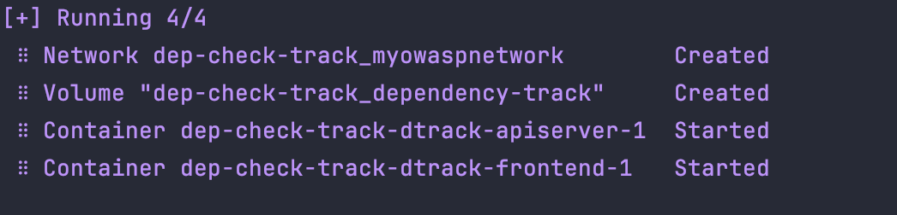
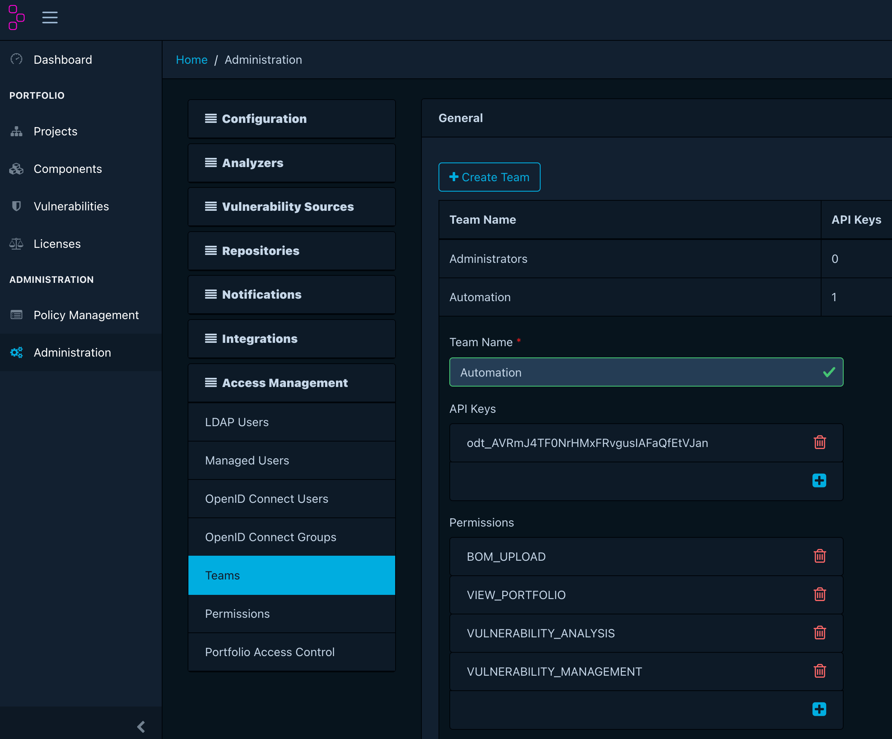
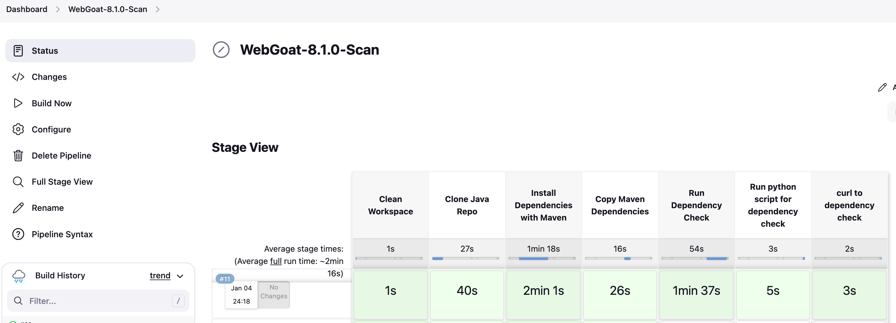
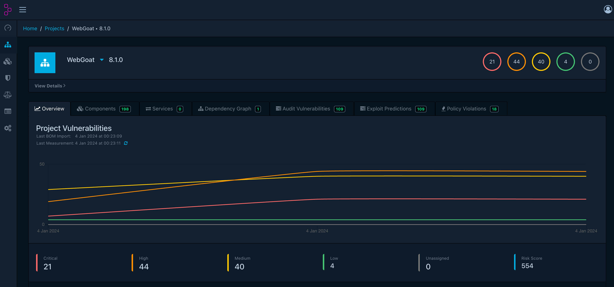

# dep-check-track


## Table of Contents

- [Introduction](#introduction)
- [Prerequisites](#prerequisites)
- [Initial Setup](#initial-setup)
- [Run Dependency Track](#run-dependency-track)
    - [Deploy with docker-compose](#deploy-with-docker-compose)
    - [setup](#setup)
- [Run Jenkins with Dependency Check](#run-jenkins-with-dependency-check)
    - [Run with docker](#run-with-docker)
    - [Jenkins initial setup](#jenkins-initial-setup)
    - [Jenkins pipeline configuration](#jenkins-pipeline-configuration)
    - [Results](#results)
    - [References](#references)

## Introduction
In this project will demonstrate how to run a [Jenkins](https://www.jenkins.io/) CI pipeline
with [OWASP Dependency Check](https://owasp.org/www-project-dependency-check/) 
to scan the [WebGoat-v.8.10](https://github.com/WebGoat/WebGoat/tree/v8.1.0) project for open source packages with known vulnerabilities and report them via [Dependency Track](https://dependencytrack.org/).

## Prerequisites

Please ensure you have the following:

1. Basic knowledge in [shell commands](https://missing.csail.mit.edu/2020/course-shell/).
1. [git](https://git-scm.com/downloads) installed on your machine.
2. [Docker](https://www.docker.com/get-started/) and [Docker Compose](https://docs.docker.com/compose/install/) installed on your machine.
## Initial Setup

1. Clone the project to your machine with the following git command :
    ```shell
    git clone https://github/ramibo/dep-check-track.git
    ```
2. Change the directory to the project directory :
    ```shell
    cd dep-check-track
    ```

3. Create a docker network :

    It will be used to connect the dependency track with jenkins. 
    ```shell
    docker network create myowaspnetwork
    ```
## Run Dependency Track

### Deploy with docker-compose

1. Run the dependency track container with the following command :
    ```shell
    docker-compose up -d
    ```
    As success message you should see something like this :
  
    

2. Open your web browser and access dependency track web ui via http://localhost:8080


### Setup
1. Login with the default credentials (admin/admin):

    **Username** : admin
  
    **Password** : admin


2. Change the default password and login credentials and relogin to the application.


3. On the left side menu go to Administration -> Access Management -> Teams -> click on **Automation** team or create a new team.
   - Copy the **API key** and save it for later use.
   - At the **Permissions** section of the team ,click on the ```+``` symbole -> select all the permissions and click on the select button.

     


4. Create a policy for the project : #Todo
   - Go to Administration -> Project -> Policies -> click on the ```+``` symbole.
   - Enter the policy name and description.
   - Select the **Automation** team.
   - Select the **High** severity level.
   - Select the **Fail build** option.
   - Click on the **Save** button.

## Run Jenkins with Dependency Check

### Run with docker

1. Build the jenkins docker image via Dockerfile
    ```shell
    docker build -t jenkins-image:latest .
    ```


2. Run the Jenkins image as a docker container ( Replace the ```DEPENDENCY_TRACK_API_KEY``` value with your api key saved in the previous step ):

    ```shell
    docker run --detach \
             --name jenkins-container \
             --network dep-check-track_myowaspnetwork \
             -p 8082:8080 \
             -p 50000:50000 \
             -v /tmp/jenkins/home:/var/jenkins_home \
             -e DEPENDENCY_TRACK_API_KEY=<YOUR_API_KEY> \
             jenkins-image:latest
    ```

3. Get the initial admin password for Jenkins and copy it to the clipboard :
    ```shell
    docker exec -it jenkins-container cat /var/jenkins_home/secrets/initialAdminPassword
    ```
    Or
    ```shell
    cat /tmp/jenkins/home/secrets/initialAdminPassword
    ```

### Jenkins initial setup
1. Open your web browser and access Jenkins web ui via http://localhost:8082
2. Paste the initial admin password you copied in the previous step.
3. Install the recommended plugins.
4. Define the admin user and password.
5. Set the jenkins url to http://localhost:8082


### Jenkins pipeline configuration
1. Go to jenkins home page and click on **New Item**.
2. Enter the item name , select **Pipeline** and click on **OK**.
3. At the **Pipeline** section select **Pipeline** script and paste script from [Jenkinsfile](Jenkinsfile) file.
4. Click on **Save** button.
5. Click on **Build Now** button to run the pipeline.

### Results
- After the pipeline finished running you should see the following results :

  - In Jenkins:

    
    
  - In Dependency Track:  

    
  
  
### References


